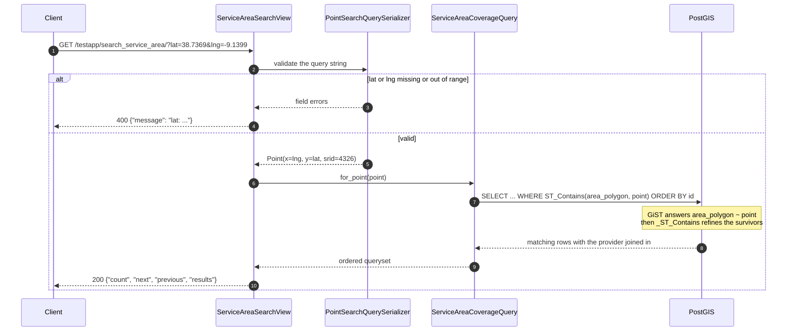
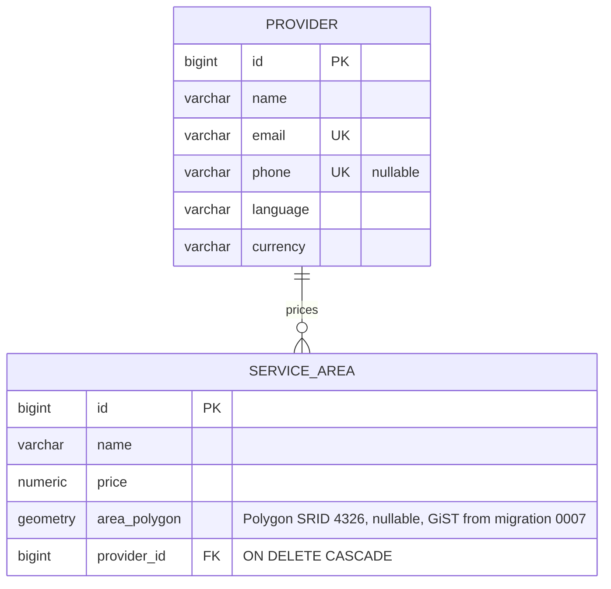

# Mozio take-home: service areas, searched by coordinate

Transfer **providers** own priced **service areas** — polygons on a map. Given a
latitude and longitude, this service answers *which areas cover this point, and
at what price?* with one PostGIS query against a GiST-indexed polygon column.

Two models, three endpoints, 82 tests. The interesting part is that one query, so
most of this README is about it: where it lives, how it is indexed, what it costs.

## The one query

`GET /testapp/search_service_area/?lat=&lng=` is the assessment. It lives in
[`testapp/queries.py`](testapp/queries.py) as a named object, not a line in a
viewset, because it has three quiet ways to be wrong: a **SRID mismatch** (so
`for_point` refuses anything but 4326 rather than letting psycopg2 report it),
**axis order** (`Point` takes `(x, y)`, i.e. `(lng, lat)` — swap them and you get
plausible wrong answers, so the conversion lives in one function), and **unstable
pagination** (`LIMIT/OFFSET` over an unordered queryset can show a row on two
pages, so the query pins `order_by("id")`, with `Meta.ordering` on both models as
a backstop — migration `0010`).



The view does nothing else: parse, delegate, paginate, serialise. Neither
`queries.py` nor `geometry.py` imports from `rest_framework`, so the spatial logic
is testable without an HTTP client — and the query object accepts a base queryset,
so narrowing to one provider reuses the spatial half.

## What the GiST index is worth, and what it is not

`area_polygon` is a `PolygonField`, which defaults to `spatial_index=True`, so
migration `0007` emits the index alongside the `ADD COLUMN` without mentioning it.
An easy thing to claim, so it was checked twice: `sqlmigrate testapp 0007` prints
`CREATE INDEX ... USING GIST ("area_polygon")`, and `\d testapp_servicearea` on a
migrated database lists it — both transcripts in
[`docs/scalability.md`](docs/scalability.md). `SpatialIndexTests` reads `pg_am` and
fails if a later migration drops it.

[`benchmark_search --count 100000`](testapp/management/commands/benchmark_search.py)
prints the plan twice — as it really runs, and with index scans disabled — so the
index gets a number rather than an adjective. PostgreSQL 17.6 / PostGIS 3.5.3,
100,000 polygons, Apple Silicon:

| | With the GiST index | Index scans off |
| --- | --- | --- |
| Execution time | **0.028 ms** | **15.928 ms** |
| Shared buffers | 11 | 2,134 |
| Plan | Index Scan on `testapp_servicearea_area_polygon_id` | Parallel Seq Scan, 50,003 rows discarded per worker |

The line worth reading is `Index Cond: (area_polygon ~ '...'::geometry)` with
`st_contains` as the refining `Filter` — PostGIS's two-phase rewrite: bounding box
from GiST, exact predicate only on the survivors. Unindexed the cost grows with
the table; indexed it does not.

**So the index is worth roughly 570x — and it is still not what will hurt first.**
End to end the same search has a median of **0.56 ms**, of which the database
spends 0.028 ms. The rest is Python, psycopg2 and GEOS deserialising the polygons
being *returned*: every result carries its full `area_polygon`, so **response size
is the real ceiling**. The fix is a serializer that drops geometry from list
responses, deliberately not applied here because the polygon is part of the
response shape the assessment documents.

The 570x is not a constant, either: a re-run tabulated in
[`docs/scalability.md`](docs/scalability.md) gave 0.018 ms against 20.3 ms, nearer
1,100x. Cache state, planner workers and table bloat all move the ratio — what
holds is three orders of magnitude, and flat instead of linear.

## The two tables



`phone` is nullable so providers without one do not collide on the unique index.
A nullable `area_polygon` comes from the original schema and is kept: an area
without a polygon simply never matches a search.

## Endpoints

All under `/testapp/`, all paginated as `{"count", "next", "previous", "results"}`
with `?page_size=` honoured up to `API_MAX_PAGE_SIZE`.

| Path | Methods |
| --- | --- |
| `/testapp/provider/` and `/testapp/provider/<id>/` | full CRUD |
| `/testapp/service_area/` and `/testapp/service_area/<id>/` | full CRUD |
| `/testapp/search_service_area/?lat=&lng=` | `GET` only |

Search requires `lat` in `[-90, 90]` and `lng` in `[-180, 180]`; bad input is
`400 {"message": "..."}` and anything but `GET` is `405`. A point exactly on a
polygon edge is **not** contained — `ST_Contains`, not `ST_Intersects` (see
below). Polygons arrive as GeoJSON, and a self-intersecting ring is rejected with
`400 {"area_polygon": ["invalid polygon: Self-intersection[5 5]"]}` before it
reaches the table, because `ST_Contains` against one is undefined.

There is no UI beyond the Django admin and DRF's browsable API, so in place of
screenshots there is a full unedited `curl` transcript against a live server in
[`docs/api-session.md`](docs/api-session.md): overlapping hits, empty results,
validation failures, pagination, writes, uniqueness rejections, the auth switch.

## Running it

You need PostgreSQL with PostGIS plus the GEOS and GDAL shared libraries
GeoDjango loads through `ctypes` — both ship with Postgres.app and most PostGIS
packages. If autodetection fails, set `GEOS_LIBRARY_PATH` / `GDAL_LIBRARY_PATH`.

```sh
python3.10 -m venv project_venv && source project_venv/bin/activate
pip install -r requirements.txt          # Django 3.2 does not support 3.11+
createdb mozio && psql -d mozio -c 'CREATE EXTENSION IF NOT EXISTS postgis;'
cp .env.example .env                     # then edit POSTGRES_* to match
python manage.py migrate
python manage.py seed_demo               # 4 providers, 8 areas in Lisbon/Berlin/NYC
python manage.py runserver
```

Three seeded Lisbon polygons overlap on purpose, so `?lat=38.7369&lng=-9.1399`
returns two providers at two different prices, 24.50 and 58.75.

### Docker, and its honest status

`docker-compose.yml` brings up PostGIS and the API on host ports 8300 and 8301,
with a multi-stage build, non-root runtime user, healthcheck, and an idempotent
entrypoint that waits for the database, migrates, seeds and creates a superuser. It
has **not been run.** The only Docker command executed here was
`docker compose config -q`, which exited 0 — a parse check, nothing more. Build
and boot are both recorded as *NOT RUN — deferred, RAM constraint*, and the
Dockerfile pins Debian bookworm package names (`libgdal32`, `libgeos-c1v5`,
`libproj25`) never resolved against a real build. Treat it as unverified.

## Settings

Read from the environment; `testproject/settings.py` also loads `.env` at import
time, and real variables win over it. Full list in
[`.env.example`](.env.example) — `POSTGRES_*` for the connection (the user needs
`CREATEDB` for the test suite), the usual `DJANGO_*` knobs, and:

| Variable | Default | Effect |
| --- | --- | --- |
| `API_REQUIRE_AUTH` | `false` | `true` keeps reads anonymous and requires auth for every write. |
| `API_PAGE_SIZE` / `API_MAX_PAGE_SIZE` | `10` / `100` | Default page, and the ceiling on `?page_size=`. |
| `GEOS_LIBRARY_PATH` / `GDAL_LIBRARY_PATH` | unset | Explicit paths when `ctypes` autodetection fails. |
| `POSTGRES_CONN_MAX_AGE` | `60` | Seconds a connection is reused across requests. |

## Tests and tooling

```sh
python manage.py test                              # 82 tests
python manage.py test testapp.tests.test_queries   # one layer
ruff check . && black --check .                    # needs requirements-dev.txt
python manage.py import_service_areas examples/service_areas.json --dry-run
python manage.py benchmark_search --count 100000   # plans and timings
```

The suite runs against a real PostGIS database. Nothing is mocked and there is no
SQLite fallback, because the behaviour under test *is* PostGIS behaviour —
`ST_Contains` on a boundary, index presence in `pg_am`, SRID rejection. Django
creates and drops `test_<POSTGRES_DB>` and enables the extension on it.

Modules are split by layer so a failure names one — models, queries, geometry,
permissions, one per API surface — with fixtures in `tests/factories.py`. Two
assertions are about cost, not behaviour: a 15-match search page costs 2 queries
(count plus page), and walking `area.provider` over the results costs none.

## Decisions worth questioning

**`ST_Contains`, not `ST_Intersects`.** For a point argument the two differ only on
the boundary, which `ST_Contains` excludes. "Covered up to but not including the
border" is the more predictable contract for a pricing lookup, and
`test_point_on_the_boundary_is_not_contained` pins it so switching would be a
visible decision. Both are index-assisted identically — semantics, not speed.

**One extension seam, at the geometry boundary.** Provider onboarding is the
realistic change: today GeoJSON over the API, tomorrow a partner's WKT dump. So
`geometry.py` is a name → reader registry with a single `normalise_polygon`
enforcing polygon-ness, validity and SRID 4326 on every path into the database,
and `import_service_areas --format` takes its `choices` from the registry. It is
the only seam because it is the only place with two callers already.

**Every endpoint is open by default, including `DELETE`.** That is the
assessment's documented surface, and silently requiring credentials would change
the thing being assessed — so the default stays open, and the decision became a
switch rather than a sentence. DRF's default permission class is
`testapp.permissions.WriteRequiresAuth`, which reads `settings.API_REQUIRE_AUTH`
*per request*: off, behaviour is identical to before; on, reads stay anonymous and
every write needs an authenticated user. Session and basic auth are configured, so
`curl -u` works. Six tests cover both modes, and the switched-on behaviour was
captured live — read `200`, anonymous `DELETE` `403`, authenticated `DELETE` `204`
— in [`docs/api-session.md`](docs/api-session.md).

## Known gaps

- **Unauthenticated by default.** The switch exists; the default is open, on
  purpose. A real deployment sets `API_REQUIRE_AUTH=true` and adds a token backend
  to `DEFAULT_AUTHENTICATION_CLASSES`.
- **The container image has never been built or booted here** — only
  `docker compose config -q` was run.
- **The search returns full polygons**, which is the real scaling ceiling rather
  than the query. Left alone to preserve the documented response shape.
- **TLS settings are unset.** `manage.py check --deploy` flags
  `SECURE_SSL_REDIRECT`, `SESSION_COOKIE_SECURE`, `CSRF_COOKIE_SECURE` and HSTS;
  enabling the redirect would break the plain-HTTP compose demo, so the gap is
  documented rather than half-fixed. `SECURE_CONTENT_TYPE_NOSNIFF` and
  `X_FRAME_OPTIONS = DENY` are set. No rate limiting or caching either.
- **Django 3.2 was deliberately not upgraded**, being the framework the assessment
  was written against, but it is past end of life (April 2024), caps the
  interpreter at Python 3.10, and omits ctypes `argtypes` on
  `GEOSGeom_createPolygon`, so the `Polygon(...)` constructor can fail against
  recent GEOS builds on arm64. The app, fixtures and tests all build geometry
  through `GEOSGeometry` from WKT or GeoJSON, which works regardless.
- **No AI features and no new product functionality** were added: the work went
  into the query, the tests and the measurement instead.
